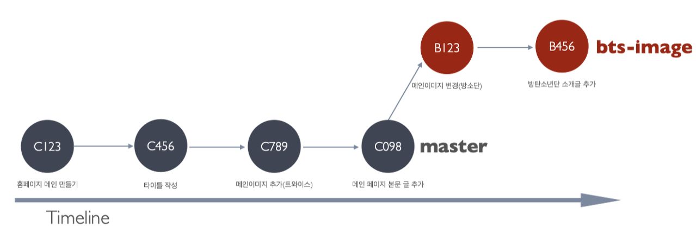
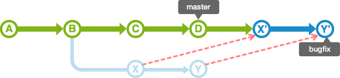

# **Q. 언어별 메모리 구조**

## [C++]

1. 코드영역(텍스트영역): 코드, 상수
   - CPU가 코드 영역에 저장된 명령어를 하나씩 가져가서 처리
2. 데이터 영역: 전역변수, 정적변수(static)
   - 프로그램의 시작과 함께 할당되고 프로그램이 종료되면 소멸
3. 힙 영역: 사용자가 관리하는 메모리(동적 할당 등)
   - 메모리의 낮은 주소에서 높은 주소의 방향으로 할당(Positive grow)
   - 런타임에 크기가 결정된다.
4. 스택 영역: 지역변수, 매개변수
   - 함수의 호출과 함께 할당되고 함수 호출이 완료되면 소멸
   - 스택에 저장되는 함수의 호출 정보를 “스택 프레임” 이라고 한다.
   - push 동작으로 데이터를 저장하고 pop 동작으로 데이터를 꺼냄(LIFO)
   - 메모리의 높은 주소에서 낮은 주소의 방향으로 할당(Negative grow)
   - 컴파일시에 크기가 결정된다.

## [Python]

- C++와 동일하지만 차이점은 사용자가 힙 영역의 메모리 관리를 하지 않아도 된다는 것
  - Python Memory Manager(PMM)가 관리해줌

## [JavaScript]

- 모든 객체가 키 밸류값으로 메모리에 저장된다.
- 따라서, 메모리 검색 속도가 다른 언어에 비해 느리며 이것을 극복하기 위해 V8엔진은 “인라이닝과 히든클래스”기법을 사용했다.

  ```
  # 인라이닝

  function test(){
     a+b
  }
  test(); <= 이 부분을 a+b로 치환
  ```

  <br>
  <br>

# **Q. 해시 충돌 해결 방법**

## 해싱(Hashing)이란?

- 하나의 문자열을 원래의 것을 상징하는 더 짧은 길이의 값이나 키로 변환하는 것(Digest)
- 해시 테이블(Bucket이 모인 것)과 해시 함수로 구성

  

## 해시 충돌(Collision)이란?

- 서로 다른 데이터가 같은 키(해시 함수의 결과)를 가질때 발생
- 입력값이 무한하지만 출력값의 가지수는 유한하므로 비둘기집 원리에 의해 충돌은 반드시 발생한다.
  - 비둘기집의 원리란 N+1개의 박스에 N개의 물건을 담을 때 어느 박스에는 두 개 이상의 물건이 들어있다는 원리(서랍 원칙, 디리클레의 방 나누기 원칙, 구두 상자의 원리 라고도 함)

## 해시 충돌 해결

### 1. 체이닝(Chaining)

- Bucket(Hash Table)내에 Linked List를 할당하여 해시 충돌이 발생하면 Linked List로 데이터를 연결하는 방식
  
- 장점
  - Linked List만 사용하면 되므로 복잡한 계산식을 사용할 필요가 적어진다
  - 해시 테이블이 채워질수록 Lookup 성능이 선형적으로 저하된다.

### 2. 개방주소법(Open Addressing)

- 체이닝의 경우 Bucket이 꽉 차더라도 Linked List로 계속 연결하므로 데이터의 주소값은 바뀌지 않는다(Closed Addressing)
- 개방 주소법은 해시 충돌이 발생하면 다른 Bucket에 데이터를 삽입하는 방식이다.
- 대표적으로 선형 탐색, 제곱 탐색, 이중 해시가 있다.
  1. 선형 탐색: $i$번째 Bucket에서 해시충돌 시 $i+n$번째 Bucket에 데이터를 삽입하는 방식
  2. 제곱 탐색: 해시 충돌 시 $i^2$만큼 건너 뛴 Bucket에 데이터를 삽입
  3. 이중 해시: 해시 충돌 시 다른 해시함수를 한 번 더 적용한 결과를 이용하여 Bucket에 삽입
- 장점
  - 포인터가 필요없고, 제정한 메모리 외 추가적인 저장공간이 필요없다.
  - 삽입, 삭제시 오버헤드가 적다.
  - 저장할 데이터가 적을 때 유리하다

<br>
<br>

# **Q. node.js가 어떻게 동작하는지(동작 원리)**

## Node.js란?

- Javascript 백엔드 프레임워크이자 런타임 환경
- Chrome V8 엔진으로 빌드
- 비동기 IO를 지원
- 데이터를 실시간 처리하여 찾은 I/O가 발생하는 SPA에 적합하며 CPU 사용률이 높은 Application에는 권장되지 않는다.

## 동작원리

- Google의 Chrome V8 JavaScript 엔진을 기본으로 동작.
- Single Thread 기반의 Event Loop(Libuv)가 돌면서 요청을 처리
  - 여러 클라이언트의 요청, 즉 여러 개의 socket connection이 있는 상태에서 하나의 Thread는 어느 socket으로부터 메시지가 들어오는지 보다가, 메시지가 들어오면 그 메시지를 꺼내 받아서 처리를 하는 방식이다.(Multiplexing)
- 시스템적으로 Non-blocking I/O를 지원하지 않는 I/O 호출이 있는 경우, 이를 비동기 처리하기 위해 내부적으로 Thread Pool(libio)을 이용

## 특징

- Async IO를 사용하므로 file upload/download 같은 네트워크 스트리밍 서비스에 유리하다.
- Real time web application을 socket.io를 이용해 쉽게 만들 수 있다.
- Single page application 개발이 쉽다
- JSON API 기반 어플리케이션
- 가볍고 생산성이 높은 웹 개발 프레임워크가 있고, 간단한 로직을 통해 대용량과 빠른 응답 시간을 요구하는 application에 적절하다.
- Single thread이므로 request 하나를 처리할 때 cpu를 많이 사용하면 다른 요청들이 지연된다. 따라서 CPU 작업이 많은 application에 적당하지 않다.

<br>
<br>

# **Q. NoSQL(Not Only SQL)**

- RDBMS가 가진 특성 뿐만 아니라 다른 특성을 부가적으로 지원한다는 의미
- 기존 RDBMS 형태가 아닌 다른 형태의 데이터 저장 기술을 총칭
- RDBMS보다 융통성있는 데이터 모델을 사용하며 데이터의 저장 및 검색을 위해 특화된 메커니즘을 제공
- 응답속도나 처리효율 등에 매우 뛰어난 성능을 보임
- 테이블간의 관계를 정의하지 않고 따라서 Join등의 관계형 연산이 없음
- 저장되는 데이터의 구조(Data Model)에 따라 4가지 종류로 나뉨

## 1. Key-Value DB

- Key와 value의 쌍으로 데이터가 저장되는 유형

## 2. Wide Columnar DB

- Big Table DB라고도 함

## 3. Document DB(Mongo DB)

- JSON, XML과 같은 Collection 데이터 모델 구조를 사용

## 4. Graph DB

- Nodes, Relationship, Key-Value 데이터 모델을 사용

<br>
<br>

# **Q. RDBMS**

## 장점

- 정해진 스키마에 따라 데이터를 저장하므로 명확한 데이터 구조를 보장
- 중복을 피할수 있어 데이터 저장 공간을 절약 가능

## 단점

- 시스템이 복잡해질수록 Query가 복잡해지고 성능이 저하
- 수평적인 확장이 어려움

<br>
<br>

# **Q. 트랜잭션이란?**

- 데이터베이스의 상태를 변화시키기 위해 수행하는 작업의 단위
- Commit: 하나의 트랜잭션이 성공적으로 수행되었고 데이터베이스가 일관성있는 상태일 때 사용하는 연산, 이 연산을 사용하면 수행했던 트랜잭션이 로그에 저장
- Rollback: 하나의 트랜잭션 처리가 비정상적으로 종료되어 트랜잭션의 원자성이 깨진경우 트랜잭션을 처음부터 다시 시작하거나 트랜잭션의 부분적으로만 연산된 결과를 취소시키는 것

## 특징(ACID)

1. 원자성(Atomicity): 트랜잭션이 데이터베이스에 모두 반영되던지 전혀 반영되지 않아야한다(All or Nothing)
2. 일관성(Consistency): 트랜잭션의 작업 처리 결과가 일관성이 있어야 한다 - 트랜잭션이 진행되는 동안 데이터베이스가 변경 되어도 기존에 참조한 데이터베이스로 트랜잭션을 진행
3. 독립성(Isolation): 둘 이상의 트랜잭션이 병행 실행되고 있을 경우 다른 트랜잭션의 연산에 끼어들 수 없다 - 하나의 특정 트랜잭션이 완료될때까지 다른 트랜잭션이 특정 트랜잭션의 결과를 참조할 수 없다
4. 지속성(Durability): 트랜잭션이 성공적으로 완료됐을 경우 결과는 영구적으로 반영되어야 한다

<br>
<br>

# **Q. 트랜잭션 충돌이 발생할 때 해결 방법**

- 트랜잭션의 직렬성: 트랜잭션들을 병행 처리한 결과가 순차적(직렬적)으로 수행한 결과와 같아지는 성질
- 직렬성 방해의 유형

  1. 충돌 직렬성

  - 문제: 두 명령어 I, J중 하나가 동시 접근한 항목 Q에 대해 Write연산 수행 시 T<sub>i</sub>, T<sub>j</sub>이 충돌.
  - 해결방안: 하나의 튜플에 대해 Read와 Write 사이에 다른 트랜잭션의 Write제거

  2. 뷰 직렬성

  - 문제: 맹목 쓰기(Blind write: read없이 write만 실행)시 직렬성이 훼손
    |T<sub>1</sub>|T<sub>2</sub>|T<sub>3</sub>|
    |:---:|:---:|:---:|
    |Read(Q)|||
    ||Write(Q)|
    |Write(Q)||
    |||Write(Q)|
  - 해결방안: 하나의 트랜잭션에 대해 Read와 Write사이의 Write를 순차적 실행
    |T<sub>1</sub>|T<sub>2</sub>|T<sub>3</sub>|
    |:---:|:---:|:---:|
    |Read(Q)|||
    |Write(Q)|
    ||Write(Q)||
    |||Write(Q)

- 직렬성 보장 방안(동시성 제어 기법)
  - Locking(Shared): 트랜잭션 수행 시 해당 트랜잭션의 데이터 항목에 대해(튜플에 대해) 읽기만 가능
  - Locking(Exclusive): 트랜잭션 수행 시 해당 트랜잭션의 데이터 항목에 대해 읽기/쓰기 모두 불가능
  - 2 Phase Locking: 모든 트랜잭션이 Lock과 Unlock 연산을 확장/수축 단계로 구분수행
  - Timestamp Ordering: DB로 들어오는 트랜잭션의 순서대로 Counter 할당 및 제어
  - Validation(낙관적검증): 트랜잭션 수행 시 어떤 검사도 하지 않고 트랜잭션 종료 후 일괄 검사
  - MVCC: 트랜잭션의 타임스탬프와 접근 데이터의 타임 스탬프를 비교하여 직렬 가능성이 보장되는 버전 선택
    <br>
    <br>

# **Q. 파이썬 GIL -> 멀티 쓰레딩을 할 때 GIL때문에 느린데 어떻게 빠르게 하는지**

## GIL(Global Interpreter Lock)

- 인터프리터에 mutex lock을 걸어서 Global Interpreter Lock 이라는 이름이 붙여짐
- Python 코드를 실행할 때 여러 thread를 사용할 경우 하나의 thread만이 Object에 접근할 수 있도록 제한하는 mutex이다
- 싱글코어에서 프로그램을 실행하면 2개의 쓰레드를 하나의 코어에서 번갈아 가면서 처리한다. 특정 시점에서 CPU는 하나의 쓰레드만 처리하고 있다.
- 멀티코어 CPU에서는 쓰레드가 여러 코어에서 동시에 돌아가야하지만 GIL이 있기 때문에 코어의 개수에 상관없이 특정 시점에서 하나의 코어(쓰레드)만 실행된다.
- 필요성: 메모리를 관리하는 방법이 thread-safe하지 않기 때문
- 결론: 파이썬에서 병렬처리를 구현하는 방법은 멀티 쓰레딩, 멀티 프로세싱 두가지이다.

  멀티 쓰레딩은 가볍지만 GIL로 인해 계산 처리를 하는 작업은 한번에 하나의 쓰레드만 동작하여 CPU 작업이 적고 I/O작업이 많은 병렬 처리 프로그램에서 효과를 볼 수 있다.

  _멀티 프로세싱은 각 프로세스가 고유한 메모리 영역을 가지기 때문에 더 많은 메모리를 필요로 하지만 각각의 프로세스에서 병렬로 CPU작업을 할 수 있다._

<br>
<br>

# **Q. REST vs GraphQL**

## REST

- REST(Representational State Transfer): HTTP 기반으로 필요한 자원(DBMS, 파일, 서비스(이메일 전송, 푸쉬 메시지))에 접근하는 방식을 정해둔 아키텍쳐
- 4가지 속성이 존재

  1. 서버에 있는 모든 자원은 클라이언트가 바로 접근할 수 있는 고유한 URI(Uniform Resource Identifier)가 존재한다.
  2. 모든 요청은 클라이언트가 요청할 때마다 필요한 정보를 주기 때문에 서버에서 세션 정보를 보관할 필요가 없다. 따라서 서비스에 자유도가 높아지고 유연한 아키텍쳐 적응이 가능하다.
  3. HTTP 메소드를 사용한다. - GET, POST, PUT, DELETE
  4. 서비스 내에 하나의 자원이 주변에 연관된 자원들과 연결되어 표현이 되어야 한다.

- REST API: REST를 통해 서비스 API를 구현한 것
- 장점
  1. 언어와 플랫폼에 독립적
  2. SOAP 보다 개발이 쉽고 단순
  3. REST가 지원하는 프레임워크나 언어 등 도구들이 없어도 구현 가능
  4. HTTP를 그대로 사용하므로 기존 웹 인프라를 사용 가능
- 단점
  1. HTTP 프로토콜만 사용가능
  2. P2P 통신 모델을 가정했으므로 둘 이상을 대상으로 하는 분산환경에는 유용하지 않음
  3. 보안, 정책등에 대한 표준이 없으므로 관리가 어려움

## GraphQL

- 구조
  1. Query와 Mutation: Query는 데이터를 읽는데 사용하고(R) 뮤테이션은 데이터를 변조(CUD)하는데 사용한다.
  2. Schema와 Type
     - 오브젝트 타입: Charater
     - 필드: name, appearsIn
     - 스칼라 타입: String, ID, Int 등
     - 느낌표(!): 필수 값(non-nullable)
     - 대괄호[]: 배열
  ```
  // Schema
  type Character {
  name: String!
  appearsIn: [Episode!]!
  }
  ```
  3. Resolver: GQL에서 데이터를 가져오는 과정을 담당. Schema의 각 필드마다 함수가 하나씩 존재하는데 이 함수를 Resolver라고 하며, 필드가 Scalar 타입인 경우 더 이상 연쇄적인 리졸버 호출이 발생하지 않음.
  4. Introspection: 연동규격서(API 명세서)를 의미하며 서버에 정의된 스키마를 공유하여 클라이언트가 연동규격서를 요청 할 필요가 없게 해줌

## REST vs GraphQL

- REST API는 URL, METHOD등을 조합하기 때문에 다양한 Endpoint가 존재하지만 GQL은 단 하나의 Endpoint만 존재
- REST API는 필요한 데이터에 따라 여러 쿼리를 보내야 할 때도 있지만 GraphQL API는 요청할 때 사용한 Query에 따라 응답의 구조가 달라지므로 하나의 쿼리만 전송하면 됨. 따라서 GQL은 HTTP 요청의 횟수와 응답의 크기를 줄일 수 있음
- GQL은 File 전송 등 Text 만으로 하기 힘든 내용을 처리하기 복잡하다.
- GQL은 요청과 응답만 필요할 경우에 Query로 인해 요청의 크기가 REST API보다 커진다.
- GQL은 재귀적인 Query가 불가능하므로 결과에 따라 응답의 깊이가 깊어질 수 있는 API를 만들 수 없다.
- REST 시나리오
  ```
  글의 목록을 가져오는 Endpoint 와 댓글의 목록을 가져오는 Endpoint 에 각각 요청을 여러 번 한다. 글이 5 개 있다고 해보자.
  이 경우에는 글의 목록을 가져오는 Endpoint 에 요청을 하고,
  각 글마다 댓글의 목록을 가져오는 Endpoint 에 요청을 5 번 해야 글과 댓글의 목록을 모두 가져올 수 있을 것이다.
  글의 목록을 가져오는 Endpoint 의 응답에 댓글의 목록을 포함한다.
  글이 5 개 있다고 해보자.
  이 경우에는 글의 목록을 가져오는 Endpoint 에 요청을 1 번 하면 끝이지만,
  글의 목록만 가져와야 하는 경우나 몇몇 글의 댓글만 가져와야 하는 경우가 있다면
  필요한 정보에 비해서 응답의 크기가 쓸데없이 큰 경우가 발생할 것이다.
  글의 목록을 가져오는 요청에 조건을 달아서 댓글의 목록을 포함할 수도, 포함하지 않을 수도 있게 한다.
  API 에 Endpoint 가 많을 경우, API 를 만드는 것이 점점 더 복잡해지고,
  결국 Facebook 에서 GraphQL 을 만든 이유와 비슷한 상황에 처하게 된다.
  ```
- GQL 시나리오
  ```
  글의 목록만을 가져와야 할 경우에는 글의 목록만을 가져오는 Query 를 작성하여 서버에 요청을 보낸다.
  글의 목록과 댓글을 모두 가져와야 할 경우에는 글의 목록과 댓글을 모두 가져오는 Query 를 작성하여 서버에 요청을 보낸다.
  ```
- 결론
  - 서로 다른 모양의 다양한 요청들에 응답할 수 있어야 하거나 대부분의 요청이 CRUD에 해당할 때는 GraphQL 사용
  - HTTP와 HTTPs에 의한 Caching을 활용하고 싶을 때 또는 File 전송 등 단순한 Text로 처리되지 않는 요청들이 있을 때 또는 요청의 구조가 정해져 있을 때 REST 사용

<br>
<br>

# **Q. Git에서 rebase와 merge의 차이**

https://backlog.com/git-tutorial/kr/stepup/stepup1_4.html

## Merge

- 머지할 두 브랜치의 마지막 커밋 하나씩과 공통 조상 커밋 한 개를 이용하는 3-way merge 방식으로 진행

## Rebase

- 두 브랜치의 공통 조상이 되는 base를 다른 브랜치의 커밋 지점으로 변경하는 것.

## **차이점**

- 기존 commit tree
  
- Merge
  
- Rebase
  
  <br>
  <br>

# **Q. Race condition에 대해 설명**

- 두 개 이상의 병렬적인 Thread들이 공유된 자원에 접근하려고 할 때 동기화 메커니즘 없이 접근하려고 하는 상황
  <br>
  <br>

# **Q. Singleton패턴에 대해 설명**

- 개념
  - Application이 시작될 때 어떤 클래스가 최초 한번만 메모리를 할당하고(Static) 그 메모리에 인스턴스를 만들어 사용하는 디자인 패턴. 생성자가 여러번 호출되어도 실제로 생성되는 객체는 하나이며 최소 생성 이후에 호출된 생성자는 최초에 생성한 객체를 반환한다. => 단 하나의 인스턴스를 생성해 사용하는 디자인 패턴.
- 사용 목적
  - 고정된 메모리 영역을 얻어 한번의 new 인스턴스를 사용하므로 메모리 낭비를 방지
  - DBCP(Database Connection Pool)처럼 공통된 객체를 여러개 생성해서 사용하는 상황에서 사용
  - 인스턴스가 절대적으로 한개만 존재하는 것을 보증하고 싶을 때
  - 두 번째 이용시부터는 객체 로딩 시간이 현저하게 줄어 성능이 향상
- 문제점
  - 싱글톤 인스턴스가 너무 많은 일을 하거나 많은 데이터를 공유시킬 경우 다른 클래스의 인스턴스들 간에 결합도가 높아져 "개방-폐쇄 원칙"을 위배하게 된다(객체 지향 설계 원칙에 어긋남) => 수정이 어렵고 테스트하기 어렵다
  - 멀티쓰레드환경에서 동기화처리를 안하면 인스턴스가 두개 생성되는 등 문제가 발생할 수 있음.
    <br>
    <br>

# **Q. DOM이란?**

- DOM(Document Object Model: 문서 객체 모델)
  - Tree형식의 자료구조를 가지고 있음
  - DOM은 HTML 문서로부터 생성되지만 동일하지 않다
    1. 작성된 HTML 문서가 유효하지 않을 때, 브라우저가 HTML문서를 읽고 DOM을 생성하는 동안 유효하지 않은 HTML 코드를 교정함 => `<head>`또는 `<body>` 등이 빠졌을 때 교정하여 추가함
    2. 자바스크립트에 의해 DOM이 수정될 때, HTML 문서의 내용이 변하지는 않지만 DOM을 업데이트 함
  - 용도
    - HTML 문서에 대한 인터페이스이다.
    - 뷰 포트에 무엇을 렌더링 할 지 결정하기 위해 사용된다.
    - 페이지의 콘텐츠 및 구조, 스타일이 자바스크립트 프로그램에 의해 수정되기 위해 사용된다.
  - HTML문서와의 차이점
    - 항상 유효한 HTML의 형식이다.
    - 자바스크립트에 의해 수정될 수 있는 동적 모델이어야 한다.
    - 가상 요소를 포함하지 않는다. (ex. ::after)
    - 보이지 않는 요소를 포함한다. (ex. display: none)

<br>
<br>

# **Q. Git merge 커밋이 생기는 이유**

https://backlog.com/git-tutorial/kr/stepup/stepup1_4.html

아래 그림과 같이 'master' 브랜치에서 분기하는 'bugfix'라는 브랜치가 있다고 가정


1. Fast-forward merge

   - 이 'bugfix' 브랜치를 'master'브랜치로 병합할 때, 'master'브랜치의 상태가 이전부터 변경되어 있지 않으면 매우 쉽게 병합할 수 있다. 'bugfix' 브랜치의 이력은 'master'브랜치의 이력을 모두 포함하고 있으므로 'master'브랜치가 단순히 이동하기만 해도 'bugfix'브랜치의 내용을 적용 할 수 있다. 이를 `fast-forward merge`라고 한다.

     

2. Non Fast-forward merge

   - 'bugfix'브랜치를 분기한 이후에 'master'브랜치에 여러 변경사항이 적용되는 경우가 있는데, 이 경우에는 'master'브랜치 내의 변경 내용과 'bugfix' 브랜치 내의 변경 내용을 하나로 통합할 필요가 있다.

     

   - 따라서 양쪽의 변경을 가져온 'merge commit'을 실행하게 된다. 병합 완료 후, 통합 브랜치인 'master' 브랜치로 통합된 이력이 아래 그림과 같이 생긴다.

     

3. Rebase

   - 위와 마찬가지로 'master' 브랜치에서 분기하는 'bugfix' 브랜치가 있다고 가정

     

   - 우선 'bugfix' 브랜치를 'master'브랜치에 rebase 하면, 'bugfix'브랜치의 이력이 'master' 브랜치의 뒤로 이동하게 된다. 이 때 이동하는 커밋 X와 Y에 포함되는 내용이 'master'의 커밋된 버전들과 충돌하는 부분이 생길 수 있으므로 각각의 커밋에 대해 발생한 충돌 내용을 수정할 필요가 있다.

     

   - rebase만 하면 아래 그림과 같이 'master'의 위치는 그대로 유지된다. 이 위치를 변경하기 위해서는 'master'브랜치에서 'bugfix'브랜치를 fast-forward 병합하면 된다.

     

<br>
<br>

# **Q. 웹 어플리케이션 구조**


- 브라우저 - 웹 서버 - 웹 어플리케이션 서버 - 데이터베이스
- Web Server
  - 클라이언트가 페이지 요청을 하면 웹 서버에서 정적 페이지(정적 페이지란 HTML 프로토콜을 통해 읽힐 수 있는 것)를 제공
  - Apache, NGINX 등
- Web Application Server

  - 동적 페이지를 제공(동적 서버 콘텐츠를 수행)
  - 주로 DB와 함께 수행된다.
  - Tomcat, Jeus, JBoss, Web Sphere

- 사용자가 특정 도메인에 접속하려고 하면 DNS서버에 해당 도메인에 매핑되는 IP주소를 요청한다. 응답받은 IP주소를 통해 Web Server에 접속요청을 보낸다. 이 요청은 WAS(Web Application Server)를 거쳐 DB로 이동하고 요청된 파일을 DB에서 가져와 다시 WAS를 거쳐 Web Server를 통해 웹 브라우저에게 전달된다.

<br>
<br>

# **Q. SQL에서 Delete, Truncate, Drop 차이**

## Delete

- Commit 이전에는 Rollback이 가능(로그를 기록)
- 데이터만 삭제하며 테이블의 용량은 줄어들지 않음(사용했던 저장 공간이 Release되지 않음)

## Truncate

- 테이블을 최초 생성된 초기상태로 변경(전체 삭제만 가능, 최초 테이블 생성시 할당된 저장 공간만 남기고 Release)
- Rollback 불가능(로그를 기록하지 않음)

## Drop

- 테이블을 제거(테이블이 사용했던 저장 공간을 모두 Release)
- Rollback 불가능

<br>
<br>

# **Q. JS 동작 원리**

- Javascript는 Single thread 기반이며 callback queue를 사용한다.
- 자바스크립트 엔진의 대표적인 예는 Google V8엔진이다. Chrome과 Node.js에서 V8엔진을 사용한다.
  - V8 엔진의 주요 구성요소는 Memory heap(메모리 할당이 일어나는 곳)과 Call Stack(코드 실행에 따라 호출 스택이 쌓이는 곳)이다.
- 자바스크립트 엔진 외에도 자바스크립트에 관여하는 다른 요소들이 많다.

  

- DOM, Ajax, setTimeout과 같이 브라우저에서 제공하는 API를 Web API라고 한다.
- Call Stack

  - Javascript는 Single thread 기반 언어이며 이것은 Call stack이 하나라는 것을 의미한다. 따라서 한 번에 한 작업만 처리 가능하다.
  - Multi thread 환경에서 제기되는 복잡한 문제들을 고려하지 않아도 된다.(데드락 등)
  - Call stack이 하나뿐이라면, 실행이 느려지면 어떻게 처리할까?

    - 비동기 처리: 특정 코드의 연산이 끝날 때까지 코드의 실행을 멈추지 않고 다음 코드를 먼저 실행하는 JS의 특성

      - 문제점: 아래 코드에서 원하는 결과는 'Hello' 출력, 3초 뒤에 'Bye'출력 후 'Hello Again'출력이지만, 실제 결과는 'Hello'출력 후 'Hello Again' 출력, 3초 뒤에 'Bye'를 출력하게 된다.(setTimeout()이 비동기이기 때문)

      ```
      console.log('Hello');

      setTimeout(function() {
         console.log('Bye');
      }, 3000);

      console.log('Hello Again');
      ```

      - Call back 함수로 비동기 처리 방식의 문제점 해결: 특정 로직이 끝났을 때 callback 함수에 로직의 결과값을 넘겨줌

      ```
      function getData(callbackFunc) {
      \$.get('https://domain.com/products/1', function(response) {
      callbackFunc(response); // 서버에서 받은 데이터 response를 callbackFunc() 함수에 넘겨줌
      });
      }

      getData(function(tableData) {
        console.log(tableData); // $.get()의 response 값이 tableData에 전달됨
      });
      ```

          - 비유: 일반적으로 맛집을 가면 사람이 많아 자리가 없다. 따라서 대기자 명단에 이름을 쓰고 자리가 날 때까지 할 일을 하고있는다. 만약 식당에서 자리가 생기면 전화로 연락을 해준다. 여기서 전화를 받는 시점이 JS에서 콜백 함수가 호출되는 시점이다. 자리가 준비된 시점(데이터가 준비된 시점)에서만 자리에 앉을 수 있다(특정 동작을 할 수 있다).

      - Call back hell(콜백지옥): 서버에서 데이터르 받아와 화면에 표시하기 까지 인코딩, 사용자 인증 등 여러 처리를 거쳐야 하는 경우가 있는데, 이 모든 과정을 비동기로 처리해야한다면 콜백 안에 콜백을 무는 형식으로 코딩을 해야한다. 이런 구조는 가독성이 떨어질 뿐더러 로직을 변경하기도 어렵다.
        ```
        $.get('url', function(response) {
          parseValue(response, function(id) {
            auth(id, function(result) {
              display(result, function(text) {
                console.log(text);
              });
            });
          });
        });
        ```
      - Call back hell 해결: Promise나 Async를 사용

    <br>
    <br>

# **Q. 각 언어별(C++ Python JS) 데이터 타입(Primitive, Reference)**

## [C++]

- Primitive Data Type
  - Integer, Character, Boolean, Floating Point, Double Floating Point, Valueless or Void, Wide Character(Character와 동일하나 8bit 데이터 타입보다 큰 사이즈(2 또는 4 byte)를 가지고 있으며, wchar_t로 표기된다.)
- Derived Data Type
  - Function, Array, Pointer, Reference
- Abstract or User-Defined Data Type

  - Class, Structure, Union(Union 타입의 변수는 같은 메모리 공간을 공유한다.), Enumeration, Typedef defined Data Type(typedef 예약어로 정의한 datatype)

    ```
    Union Type 예시

    #include <iostream>
    using namespace std;

    // Declaration of union is same as the structures
    union test {
      int x, y;
    };

    int main()
    {
      // A union variable t
      union test t;

      // t.y also gets value 2
      t.x = 2;

      cout << "After making x = 2:"
        << endl
        << "x = " << t.x
        << ", y = " << t.y
        << endl;

      // t.x is also updated to 10
      t.y = 10;

      cout << "After making Y = 10:"
        << endl
        << "x = " << t.x
        << ", y = " << t.y
        << endl;

      return 0;
    }
    =============OUTPUT==============
    After making x = 2:
    x = 2, y = 2
    After making Y = 10:
    x = 10, y = 10
    ```

## [Javascript]

- Primitive Data Type
  - Boolean, Number, String, null, undefined (값복사 - 얕은 복사)
- Reference Data Type
  - Object(array, function, object) (주소복사 - 깊은 복사)

## [Python]

- Reference Data Type
  - Numeric Type: int, float, complex(복소수)
  - Iterator Type: Generator Type
  - Sequence Type: list, tuple, range
  - Text Sequence Type: str
  - Binary Sequence Type: bytes, bytearray, memoryview
  - Set Type: set, frozenset
  - Mapping Type: dict
  - Other Type: Module, Class, Class Instance, Function, Method, Code Object, Type Object, Null Object, Ellipsis Object, NotImplemented Object, Boolean Value, Internal Obejct
- Primitive Type: 없음
  <br>
  <br>

# **Q. 스마트 포인터**

스마트 포인터란 메모리 누수로부터 프로그램의 안전성을 보장하기 위해 제공된다. 포인터처럼 동작하는 클래스 템플릿으로, 사용이 끝난 메모리를 자동으로 해제해준다.

- new 키워드를 사용해 기본 포인터가 실제 메모리를 가리키도록 초기화한 후에, 기본 포인터를 스마트 포인터에 대입하여 사용한다. 이렇게 정의된 스마트 포인터의 수명이 다하면, 소멸자는 delete 키워드를 사용하여 할당된 메모리를 자동으로 해제하므로 new 키워드가 반환하는 주소값을 스마트 포인터에 대입하면 따로 메모리를 해제할 필요가 없다.
- memory 헤더 파일에 정의되어 있으며, C++11 이전은 auto_ptr이라는 스마트 포인터를 사용했으나 C++11 이후 auto_ptr은 삭제되고 다음 세가지 포인터를 제공한다.
- 종류
  1. unique_ptr
     - 하나의 스마트 포인터만이 특정 객체를 소유할 수 있도록 객체에 소유권 개념을 도입
     - unique_ptr 인스턴스는 move() 함수를 통해 소유권을 이전할 수 있지만 복사할 수는 없다.
  2. shared_ptr
     - 하나의 특정 객체를 참조하는 스마트 포인터의 개수를 참조하는 스마트 포인터, 참조하고 있는 스마트 포인터의 개수를 참조 횟수(reference count)라고 함
     - 특정 객체에 새로운 shared_ptr이 추가될 때마다 1씩 증가하며, 수명이 다할 때마다 1씩 감소함
  3. weak_ptr
  - 하나 이상의 shared_ptr 인스턴스가 소유하는 객체에 대한 접근을 제공하지만, 소유자의 수에는 포함되지 않는 스마트 포인터
  - 서로가 상대방을 가리키는 shared_ptr를 가지고 있다면 참조 횟수는 절대 0이 되지 않으므로 메모리가 영원히 해제되지 않는데, 이 상황을 순환 참조라고 하며 weak_ptr은 순환 참조를 제거하기 위해 사용
    <br>
    <br>

# **Q. C++에서 auto 키워드**

- 초기화하는 값에 따라 알아서 자료형을 결정해준다. 따라서 선언만 하는 것은 불가능하다.
- variable, pointer, reference, structure, union, class, function, function pointer 등의 타입으로 초기화 될 수 있다.

<br>
<br>

# **Q. 뮤텍스&세마포어**

- 공통점

  - 여러 Process 또는 Thread가 공유 자원에 접근하는 것을 제어하기 위한 방법. 즉, 병행 처리를 위한 프로세스 동기화 기법이다.

- 차이점

  - 세마포어는 공유 자원에 세마포어 변수의 값만큼의 프로세스 또는 쓰레드가 접근할 수 있지만 뮤텍스는 오직 1개의 프로세스 또는 쓰레드만 접근할 수 있다.
  - 세마포어는 현재 수행중인 프로세스가 아닌 다른 프로세스가 세마포어를 해제할 수 있지만 뮤텍스는 lock을 획득한 프로세스가 해제해야 한다.

  ## 세마포어

  - 동작원리: 세마포어 변수의 값을 Wait, Signal연산을 통해 증감시키며 동작
  - 세마포어 변수: 세마포어는 정수 값을 가지는 변수로 볼 수 있다. 이 정수 값은 접근할 수 있는 최대 허용치 만큼 사용자 접근을 할 수 있게 한다.
  - semWait 연산: 세마포어 변수의 값을 감소시킨다. 감소시킨 결과값이 음수가 되면 semWait을 호출한 프로세스는 블록(Sleep)되며 음수가 아니면 프로세스는 계속 수행된다.
  - semSignal 연산: 세마포어 변수의 값을 증가시킨다. 증가시킨 결과값이 음수면, semWait 연산에 의해 블록(Sleep)된 프로세스를 깨운다.
  - 유지할 수 있는 값의 범위에 따라 이진 세마포어와 범용 세마포어(카운팅 세마포어)로 구분된다. 세마포어의 초기값이 0이상의 수인 경우를 범용 세마포어라고 하며, 세마포어의 초기 값이 0 또는 1만 가질 수 있는 경우 이진 세마포어라고 한다. 이진 세마포어는 뮤텍스와 비슷한 것이다.
  - 세마포어는 블록된 프로세스들을 큐에 대기시키는데, 선입선출로 프로세스를 꺼낸다면 강성 세마포어라고 하며 큐에서 꺼내는 순서를 명시하지 않은 세마포어를 약성 세마포어라고 한다.

  ## 뮤텍스

  - 동작 원리: 임계영역(Critical Section)의 명령을 수행할 때(진입하기 직전) 락(Lock)을 걸어 다른 Process(또는 Thread)가 접근하지 못하도록 하고, 임계영역에서 나오기 직전 해당 락을 해제(Unlock)한다.
  - 임계영역(Critical Section): 공유 자원의 독점을 보장해주는 영역
    <br>
    <br>

# **Q. JS에서 var와 let과 const의 차이**

- Hoisting: 변수 선언문, 함수 선언문 등을 해당 스코프의 선두로 옮긴 것 처럼 동작하는 특성
- var: function-scoped 단위로 hoisting, 변수 재 선언 가능, 값 수정 가능(mutable)
  ```
  // var는 function-scope이기 때문에 for문이 끝난다음에 i를 호출하면 값이 출력이 잘 된다.
  // 이건 var가 hoisting이 되었기 때문이다.
  for(var j=0; j<10; j++) {
    console.log('j', j)
  }
  console.log('after loop j is ', j) // after loop j is 10
  ```
  ```
  // 아래의 경우에는 에러가 발생한다.
  function counter () {
    for(var i=0; i<10; i++) {
      console.log('i', i)
    }
  }
  counter()
  console.log('after loop i is', i) // ReferenceError: i is not defined
  ```
- let: block-scoped 단위로 hoisting(선언문 전에 참조 시 temporal dead zone으로 인해 ReferenceError가 발생), 변수 재 선언 불가능, 값 수정 가능(mutable)
- const: block-scoped 단위로 hoisting, 변수 재 선언 불가능, 값 수정 불가능(immutable)

<br>
<br>

# **Q. ECMA Script(ES)**

- ECMA International에서 정의한 스크립트 언어의 사양. ECMA-262라고도 함
- 매년 업데이트된다.
- ES6(2015)에 추가된 기능
  - **_Arrows(화살표 함수)_**, Classes(클래스), Enhanced Object Literals(오브젝트 메소드 선언 및 속성(동적) 선언), Template String(템플릿 문자열), Destructuring(구조분해할당), Default + Rest + Spread(Default 파라미터, Rest 파라미터, 전개연산자), **_Let + Const(Block level scoped 변수)_**, Iterator + for...of, Generators, Unicode, Modules, module loaders, map + set + weakmap + weakset, proxies, symbols, subclassable built-ins, **_promises(비동기 프로그래밍)_**, math + number + string + array + object APIs, binary and octal literals, reflect api, tail calls
- ES7(2016)
  - Array.prototype.includes(), 지수 연산자(\*\*)
- ES8(2017)
  - Async Functions(async ~ await), Shared memory and atomic(SharedArrayBuffer 객체와 Atomics 객체를 사용한 메모리 공유)
- ES9(2018)
  - Asynchronous Iteration(비동기반복: for-await-of), Rest/Spread Properties(전개 연산 및 rest 파라미터 -> 배열로 변경)
- ES10(2019)
  - Optional Catch: catch의 매개변수를 쓰지 않는 경우 error를 생략해도 된다.
- ES11(2020)
  - Nullish coalescing Operator(??연산자): 왼쪽 피연산자 값이 null 또는 undefined일 경우 오른쪽 피연산자를 반환하고, 그렇지 않으면 왼쪽 피연산자를 반환한다.

<br>
<br>

# **Q. AOT 컴파일과 JIT 컴파일**

- AOT 컴파일: 설치되는 순간 모든 코드를 기계어로 변환한 후 ROM에 저장한다. 따라서 용량이 크다.
- JIT 컴파일: 실행되는 순간 바이트 코드를 기계어로 변환한 후 캐싱하여 RAM에 저장한다. 설치시간이 빠르지만 실행 시간이 느리다.
  <br>
  <br>

# **Q. C++에서 Namespace란?**

- 모든 식별자(변수, 함수 등)가 고유하도록 보장하는 코드 영역
- 전역 변수와 일반 함수는 전역 네임스페이스에서 정의된다.
- 두 개 이상의 독립된 코드가 함께 사용될 때 서로 이름이 충돌하는 문제를 방지하기위해 namespace 키워드를 통해 자체 네임스페이스를 선언할 수 있다.

<br>
<br>

# **Q. Library와 Framework**

- Library: 자주 사용되는 로직을 재사용하기 편리하도록 정리한 일련의 코드들의 집합
- Framework: 소프트웨어의 구체적인 부분에 해당하는 설계와 구현을 재사용이 가능하도록 일련의 협업화된 형태로 클래스를 제공하는 것
- 비유: Framework는 자동차의 프레임(뼈대)를 의미하고, Library는 자동차의 기능을 하는 부품(바퀴, 헤드라이트, 와이퍼 등)을 의미. 한번 결정된 자동차의 프레임은 변경할 수 없지만 부품은 변경할 수 있다.

<br>
<br>

# **Q. 객체지향**

- 데이터를 추상화시켜 상태와 액션을 가진 객체를 생성하고, 객체들간의 상호작용을 통해 로직을 구성하는 프로그래밍 방법
- 장점
  1. 코드 재사용성
  2. 유지보수성
  3. 대형 프로젝트에 적합
- 단점
  1. 느린 처리속도
  2. 객체가 많아지면 용량이 커짐
  3. 설계에 많은 비용이 발생
- 키워드
  1. 클래스+인스턴스(객체)
     - 클래스: 어떤 문제를 해결하기 위한 데이터를 추상화를 거쳐 집단의 상태(속성)과 액션(행위)를 변수와 메소드로 정의한 것
     - 인스턴스(객체): 클래스에서 정의한 것을 바탕으로 실제 메모리에 할당된 것으로 실제 프로그램에서 사용되는 데이터
  2. 추상화
     - 불필요한 정보는 숨기고 중요한 정보만을 표현함으로써 공통의 속성이나 기능을 묶어 이름을 붙이는 것(클래스를 정의하는 것)
  3. 캡슐화
     - 관련된 기능과 특성을 한 곳에 모으고 분류(속성과 액션의 모음을 클래스라는 캡슐에 넣는 것)
     - 코드를 재사용하기위한 목적
  4. 상속
     - 부모클래스의 속성과 기능을 그대로 이어받아 사용할 수 있게하고, 기능의 일부분을 변경해야 할 경우 상속받은 자식 클래스에서 해당 기능만 수정하여 사용할 수 있게 하는 것.
  5. 다형성
     - 하나의 변수명, 함수명 등이 상황에 따라 다른 의미로 해석될 수 있는 것
     - 오버라이딩: 부모클래스의 메소드와 같은 이름, 같은 매개변수를 같은 메소드를 재정의 하는 것
     - 오버로딩: 같은 이름의 함수를 여러개 정의하고, 매개변수의 타입 및 개수를 다르게하여 매개변수에 따라 다르게 호출할 수 있게 하는 것
       <br>
       <br>

# **Q. 추상클래스와 인터페이스**

- 추상 클래스
  - 추상적인 개념을 표현하고, 완성되지 않은 메소드를 가지고 있는 클래스
  - 메소드가 미완성이므로 객체를 생성할 수 없다
  - 상속관계에서 추상적인 개념을 나타내기 위한 목적으로 사용되며 단일 상속이 가능하다
  - 추상 메소드를 하나라도 가지고 있으면 추상 클래스가 된다.
  - 추상 메소드: 동작 방식을 결정할 수 없을 때 선언만 하고 동작 부분을 기술하지 않고 비워두는 메소드
- 인터페이스
  - 객체와 객체 사이의 상호 작용을 나타낸다.
  - 다중 상속의 기능을 구현하려고 할 때 사용한다.
  - 추상 메소드만 가질수 있다.

<br>
<br>

# **Q. call by value, call by reference**

- call by value
  - 함수 호출 시 전달되는 변수의 값을 복사하여 함수의 인자로 전달한다.
  - 전달받은 인자는 함수 안에서 지역적으로 사용되는 지역변수의 특성을 가진다.
  - 따라서, 함수 안에서 인자의 값이 변경되어도 외부 변수의 값은 변경되지 않는다.
  - 파이썬의 경우 immutable 객체가 인자로 전달되면 처음에는 call by reference로 전달받지만, 값이 변경되면 call by value로 동작한다.
- call by reference
  - 함수 호출 시 인자로 전달되는 변수의 주소값을 전달한다.
  - 따라서 함수 안에서 인자의 값이 변경되면 외부 변수의 값도 변경된다.
  - 파이썬의 경우 mutable 객체가 인자로 전달되면 call by reference로 동작한다.

<br>
<br>

# **Q. Java에서 Array와 Array List의 차이**

- 배열
  - 배열의 크기는 한번 정하면 크기를 변경 할 수 없다.
  - 배열 초기화시 메모리에 할당되어 ArrayList보다 속도가 빠르다.
- ArrayList
  - 크기가 가변적이다.(저장하는 데이터 수에 따라서 크기가 변경된다.)
  - 데이터 추가는 add(), 삭제는 remove()를 사용한다.
  - 데이터 추가 삭제시 메모리를 재할당하므로 배열보다 속도가 느리다.

<br>
<br>

# **Q. 자료구조**

- 자료구조란 데이터에 대해 효율적 접근 및 수정을 가능하게 하는 데이터 조직, 관리, 저장방법을 의미한다.
- 선형 자료구조
  - 배열
    - 길이를 변경할 수 없다. 길이가 가변적인 배열(Vector)도 있지만 리소스 낭비가 크다.
    - 인덱스를 이용해 값을 조회할 수 있어 속도가 빠르다.
    - 인덱스에 따라서 값을 유지하기 때문에, 엘리먼트가 삭제되어도 빈자리가 남는다.(불필요한 메모리 낭비)
  - 리스트
    - 배열이 갖는 인덱스 구조의 장점을 버린 대신, 메모리의 낭비를 줄였다.
    - 따라서 데이터의 삽입과 삭제에 대한 메모리 낭비가 줄고, 검색 속도가 늘어났다.
    - Array List
      - 내부적으로 배열을 사용하므로 인덱스를 이용해 데이터에 접근이 가능
      - 데이터 검색 속도가 빠르지만 데이터를 추가하거나 삭제하게 되면 각 순서가 일정하게 변경되어야 하므로 상대적으로 느리다.
    - Linked List
      - 배열을 사용하지 않고, 하나의 데이터에 다음 엘리먼트의 위치정보를 포함한다.
      - 특정 데이터를 조회하는 인덱스가 존재하지 않으므로 조회하는 속도가 느리다
      - 데이터를 추가하거나 삭제하게 되어도 다른 데이터에 영향을 주지 않으므로 상대적으로 빠르다.
    - 일반적으로 고정된 데이터의 검색이 필요하면 Array List, 검색이 필요없는 가변적인 데이터가 필요한 경우에는 Linked LIst를 사용한다.
  - 큐
    - FIFO or LILO(선입선출 또는 후입후출)구조이다. 대표적인 예시로 버퍼(Buffer)가 있다.
  - 스택
    - LIFO(후입선출)구조이다.
- 비선형 자료구조
  - 그래프
    - 노드와 다른 노드를 연결하는 엣지를 이용해 데이터를 관리하는 자료구조
    - 연결되어 있는 객체간의 관계를 표현할 수 있다.
    - 방향성에 따라 방향그래프/무방향그래프로 나뉜다.
    - 사이클(단순 경로의 시작 정점과 종료 정점이 동일)에 따라 순환그래프/비순환그래프로 나뉜다.
    - 자체 간선(Self-loop)
    - 루트, 부모-자식의 개념이 없으며 에시로 네트워크 모델이 있다.
    - 용어
      - 정점(vertex, node)
      - 간선(edge)
      - 인접 정점(adjacent vertex)
      - 정점의 차수(degree)
      - 진입 차수(in-degree): 방향 그래프에서 외에서 오는 간선의 수
      - 진출 차수(out-degree): 방향 그래프에서 외부로 향하는 간선의 수
      - 경로 길이: 경로를 구성하는 데 사용된 간선의 수
      - 단순 경로: 경로 중에서 반복되는 정점이 없는 경우
    - 인접리스트 또는 인접행렬로 그래프를 표현한다.
  - 트리
    - 방향, 비순환 그래프 + 계층 모델(부모-자식) +자체 간선 불가
    - 한 개의 루트 노드만이 존재(모든 자식 노드는 한 개의 부모 노드 만을 가진다.)
    - 이진트리, 이진탐색트리, 균형트리, 이진힙 등

<br>
<br>

# **Q. JS에서 ===와 ==의 차이**

- 동등연산자(==): 두 피연산자를 타입 캐스팅하여(타입을 맞추어) 비교
- 일치연산자(===): 두 피연산자의 타입까지 비교

<br>
<br>

# **Q. 쓰레드, 프로세스**

- 프로세스
  - 메모리에 올라와 실행되는 프로그램의 인스턴스(독립적 개체)
  - 운영체제로부터 시스템 자원(CPU, 메모리 등)을 할당받는 작업의 단위
- 쓰레드
  - 프로세스 내에서 실행되는 여러 흐름의 단위
  - 프로세스의 특정한 수행 경로
  - 프로세스가 할당받은 자원을 이용하는 실행의 단위
  - 프로세스 생성 시 별도의 쓰레드를 생성하지 않는다면 하나의 쓰레드(메인 쓰레드)만 생성
  - 여러 프로세스는 Stack영역의 메모리만 개별적으로 할당받으며, Code, Data, Heap영역은 공유함
    <br>
    <br>

# **Q. C++ virtual**

- 상속 관계에서 자식 클래스가 부모 클래스의 메소드를 오버라이딩 하기 위해 사용
- 가상함수라고 함
  - 순수 가상 함수
    - 부모 클래스에서 구현부 없이 선언만 한 함수
    - 자식 클래스에서 해당 함수를 반드시 구현해야 함
  - 일반 가상 함수: 부모 클래스에서 구현
    - 자식 클래스에서 해당 함수를 구현하지 않아도 됨(부모 클래스의 함수 사용)

<br>
<br>

# **Q. 자바와 C++의 오버라이딩**

- 자바는 실제 객체의 메소드를 수행하고, C++은 객체를 선언할 때 명시한 타입을 따름

  ```
  main(){
     Dog dog = new Dog();
     dog.eat();
     Animal animal = dog;
     animal.eat();
  }

  class Animal{
      void eat(){print("동물이 먹는다.");}
  }

  class Dog extends Animal{
      void eat(){print("개가 먹는다.");}
  }
  ```

  - C++: 개가 먹는다. 동물이 먹는다.
  - Java: 개가 먹는다. 개가 먹는다.

<br>
<br>

# **Q. C++ 메모리 관리**

- 사용이 끝난 메모리는 해제한다.
- 새로운 메모리를 할당 할 때: new 또는 malloc 사용
  - 힙 영역의 메모리를 할당 받는다.
  - new
    - 할당된 메모리의 주소값을 반환함(포인터 변수로 받아야 함)
    - 생성자를 호출 함(초기값을 줄 수 있음)
    - 예외 발생 시 예외처리
    - 할당 된 메모리 크기를 재조정 할 수 없음
  - malloc
    - void* 자료형을 리턴함. 따라서 `int *i = (int\*)malloc(sizeof(int))`와 같이 자료형을 선언해줘야 함
    - 생성자를 호출하지 않으므로 초기값을 줄 수 없음
    - 예외 발생 시 Null을 리턴
    - 메모리 크기 재조정 가능
  - delete
    - 소멸자를 호출
  - free
    - 소멸자를 호출하지 않음
- [스마트 포인터](#q-스마트-포인터) 이용

<br>
<br>

# **Q. 시스템 콜**

- https://whitesnake1004.tistory.com/2
- 응용 프로그램에서 운영체제에게 명령할 수 있는 함수
- 시스템 콜을 사용하면 사용자 모드에서 커널 모드로 바뀌고, 커널에서 처리가 끝나면 다시 사용자 모드로 돌아간다.
- 프로세스 제어, 파일 조작, 장치 관리, 정보 유지, 통신 등의 유형이 있음
- 자주 사용될 것 같은(?) 시스템 콜
  - exit(1): 현재 프로세스 종료
  - fork(2): 자식 프로세스 생성
  - read(3): 파일 지정자 읽기
  - write(4): 파일 지정자 쓰기
  - open(5): 파일 또는 장치 열기
  - close(6): 파일 지정자 닫기
  - waitpid(7): 프로세스의 종료를 기다림
  - execv(11): 프로그램 실행
  - chdir(12): 작업 디렉토리 변경
  - time(13): 초단위 시간 얻기
  - chmod(15): 파일 권한 변경
  - chown(16): 파일 소유자 변경
  - getpid(20): 프로세스 ID를 얻어옴
  - kill(37): 프로세스에 종료 시그널을 전송
  - rename(38): 파일 이름 및 위치를 변경
  - mkdir(39): 디렉토리 생성
  - rmdir(40): 디렉토리 제거
    <br>
    <br>

# **Q. OSI 7계층과 TCP/IP 4계층**


- OSI 참조모델이란 컴퓨터와 컴퓨터 사이의 데이터 전송을 분류한 모델
  - 데이터 송신 시 7계층부터 1계층까지 packing(encapsulation)하며 수신 시 1계층부터 7계층까지 unpacking(decapsulation)함 => 각 계층은 독립적 구조
  - 물리 계층
    - 전기적, 기계적 특성을 이용해 통신 케이블로 전기적 신호를 전송
    - 오직 데이터 전달 역할만 함
    - 케이블, 리피터, 허브 등의 장비
    - Process Data Unit: 비트(Bits)
  - 데이터링크 계층
    - 물리적 연결을 통해 인접한 두 장치의 신뢰성 있는 정보 전송을 담당
    - 정보의 오류와 흐름을 관리
    - 브릿지, 스위치(L2) 등의 장비
    - Process Data Unit: 프레임(Frames)
  - 네트워크 계층
    - 목적지까지 경로를 설정(라우팅)
    - 데이터를 목적지까지 안전하고 빠르게 전달
    - 라우터, 스위치(L3)
    - Process Data Unit: 패킷(Packets)
  - 전송 계층
    - 종단간 신뢰성 있고 정확한 데이터를 전송
    - 종단간 에러 복구와 흐름제어 담당
    - TCP, UDP등의 프로토콜
    - 스위치(L4)
    - Process Data Unit: 세그먼트(Segments)
  - 세션 계층
    - 통신장치 간 상호작용 및 동기화를 제공
    - 연결 세션에서 데이터 교환과 에러 발생시 복구를 관리(논리적 연결을 담당)
    - Process Data Unit: 데이터(Data)
  - 표현 계층
    - 데이터 표현에 차이가 있는 응용 처리에서 제어 구조를 제공
    - 데이터의 인코딩, 디코딩, 암호화, 코드변화 등을 담당
    - ASCII, JPEG, MPEG 등
    - Process Data Unit: 데이터(Data)
  - 응용 계층
    - 사용자와 가장 밀접한 계층으로, 인터페이스의 역할을 함
    - 응용 프로세스 간 정보 교환
    - 전자메일, 인터넷 서비스, 동영상 플레이어 등
    - Process Data Unit: 데이터(Data)
- TCP/IP 모델이란 TCP 프로토콜과 IP 프로토콜을 OSI 7계층 형식에 맞춰 더 추상화(간략화) 시킨 모델.
  - 네트워크 액세스 계층
    - OSI 7계층의 물리, 데이터 링크 계층에 해당
    - 물리적인 주소로 MAC을 사용
    - Ethernet
  - 인터넷 계층
    - OSI 7계층의 네트워크 계층에 해당
    - 통신 노드 간 IP패킷을 전송하는 기능과 라우팅 기능을 담당
    - IP, ICMP, ARP, RARP, OSPF, BGP 등의 프로토콜
  - 전송 계층
    - OSI 7계층의 전송 계층에 해당
    - 통신 노드 간 연결을 제어하고 신뢰성 있는 데이터를 전송
    - TCP, UDP 등의 프로토콜
  - 응용 계층
    - OSI 7계층의 세션, 표현, 응용 계층에 해당
    - TCP, UDP 기반의 응용 프로그램을 구현할 때 사용
    - SMTP, FTP, HTTP, DNS 등의 프로토콜
- 클라이언트에서 어떤 주소(aaa.com)를 입력하고 데이터를 받아오기 까지의 과정
  1. 자신의 IP 주소, 첫번째 홉 라우터 주소, DNS 서버 주소를 얻기 위해 DHCP 요청을 생성
  2. DHCP 요청을 LAN에 브로드 캐스트
  3. DHCP 서버가 실행되고 있는 라우터에서 DHCP 요청을 수신
  4. DHCP 서버가 클라이언트의 IP, 첫번째 홉 라우터 주소, DNS 서버의 이름, DNS 서버의 IP를 포함한 DHCP ACK를 응답
  5. 클라이언트가 DHCP ACK 응답을 수신
  6. aaa.com에 대한 DNS 쿼리를 생성
  7. DNS 쿼리를 라우터로 보내기 위해 라우터의 MAC 주소를 알아야함. IP를 MAC으로 변경해주는 ARP 쿼리를 전송
  8. ARP 응답을 통해 라우터의 MAC주소를 얻음
  9. DHCP ACK 응답에 포함되어 있는 DNS 서버의 이름과 DNS 서버의 IP 주소(DNS쿼리)를 포함한 IP 데이터 그램을 첫번째 홉 라우터의 MAC주소로 전송
  10. IP 데이터 그램이 라우팅 되어 DNS서버에 전달 됨
  11. DNS 서버에서 aaa.com의 IP주소를 응답
  12. 클라이언트는 aaa.com의 IP주소를 수신하고 HTTP 요청을 보내기 위해 TCP 소켓을 생성 해야함
  13. 클라이언트가 서버로 TCP SYN segment를 라우팅
  14. 서버가 클라이언트로 TCP SYN/ACK로 응답
  15. 클라이언트가 서버로 ACK를 전송하며 TCP 연결이 생성
  16. TCP 소켓을 통해 aaa.com의 IP로 HTTP 요청을 전송
  17. 서버가 HTTP 응답을 전송
  18. HTTP 응답이 들어있는 IP 데이터 그램이 클라이언트에게 라우팅

# **Q. TCP와 UDP**

- TCP
  - 연결형 서비스, 가상 회선 방식 제공
    - 가상 회선 방식이란? 발신지와 수신지를 연결하여 패킷을 전송하기 위한 논리적 경로를 배정
      
  - 3-way handshaking과정을 통해 연결을 설정하고, 4-way handshaking과정을 통해 연결을 해제
    - 3-way handshaking
      1. 클라이언트가 Seq #를 임의의 랜덤 숫자로 지정하고 SYN 플래그 비트를 1로 설정한 세그먼트를 전송(클라이언트 포트: Closed, 서버 포트: Listen->SYN_RCV)
      2. 서버가 Seq #을 랜덤 숫자, Ack #을 클라이언트에서 받은 Seq # +1로 설정하고 SYN과 ACK 플래그 비트를 1로 설정한 세그먼트를 전송(클라이언트 포트: Closed->Established, 서버 포트: SYN_RCV)
      3. 클라이언트가 Ack #을 서버에서 받은 Seq # +1로 설정하고 ACK를 전송(클라이언트 포트: Established, 서버 포트: SYN_RCV -> Established)
  - 4-way handshaking
    1.  클라이언트가 FIN 플래그를 전송
    2.  서버가 ACK 플래그를 전송, 남은 데이터를 전송
    3.  서버가 FIN 플래그를 전송
    4.  클라이언트가 ACK 플래그를 전송
  - UDP에 비해 높은 신뢰성을 보장하지만 속도가 느리다.
  - 속도가 느린 이유는 데이터의 흐름제어나 혼잡제어 등의 기능을 하기 때문
  - 연속성보다 신뢰성 있는 전송이 필요할 때 사용하는 프로토콜(예를들어 파일 전송)
  - 서버와 클라이언트가 1:1로 연결
- UDP
  - 비연결형 서비스, 데이터그램 방식 제공
  - 비연결형 서비스이므로 연결을 설정하고 해제하는 과정이 없으며 서로 다른 경로로 독립적으로 처리함
    
  - UDP 헤더의 CheckSum필드를 통해 최소한의 오류만 검출
  - 신뢰성이 필요한 서비스보다는 연속성이 중요한 실시간 서비스(스트리밍 등)에 사용

<br>
<br>

# **Q. 정렬 알고리즘**

- 선택정렬(Selection Sort)
  - 
  - 해당 순서에 원소를 넣을 위치는 정해져 있고, 어떤 원소를 넣을지 선택하는 알고리즘
    1. 주어진 배열 중 최소값을 찾는다
    2. 맨 앞에 위치한 값과 교체한다
    3. 맨 앞 위치를 제외한 나머지 배열에 대해 위 과정을 반복한다
  - 시간 복잡도: 최선, 평균, 최악 모두 $O(n^2)$
  - 공간 복잡도: 주어진 배열 안에서 교환을 통해 수행되므로 $O(n)$ (in-place)
  - 장점
    - 알고리즘이 단순하다.
    - 정렬을 위한 비교 횟수는 많지만 실제로 교환하는 횟수는 적기 때문에 많은 교환이 일어나야 하는 자료 상태에서 비교적 효율적
  - 단점
    - 시간 복잡도가 $O(n^2)$으로 비효율적이다.
    - 불안정 정렬이다.(순서가 보장되지 않음)
  - 코드
    ```
     void selectionSort(int[] arr) {
       int indexMin, temp;
       for (int i = 0; i < arr.length-1; i++) {        // 1.
         indexMin = i;
         for (int j = i + 1; j < arr.length; j++) {  // 2.
           if (arr[j] < arr[indexMin]) {           // 3.
             indexMin = j;
           }
         }
       // 4. swap(arr[indexMin], arr[i])
       temp = arr[indexMin];
       arr[indexMin] = arr[i];
       arr[i] = temp;
       }
       System.out.println(Arrays.toString(arr));
     }
    ```
- 삽입정렬(Insertion Sort)
  - 
  - 2번째 원소부터 시작해서 그 앞의 원소들과 비교하여 삽입할 위치를 지정한 후 원소를 뒤로 옮기고 지정된 자리에 자료를 삽입하여 정렬하는 알고리즘
    1.  2번째 인덱스의 값을 temp에 저장한다
    2.  temp와 2번째 인덱스 이전에 있는 원소들과 비교하며 교체한다.
    3.  첫번째 과정으로 돌아가 다음 인덱스의 값을 temp에 저장하고 반복함
  - 시간 복잡도: 평균, 최악의 경우(역으로 정렬) $O(n^2)$, 최선의 경우(정렬된 상태) $O(n)$
  - 공간 복잡도: 주어진 배열 안에서 교환을 통해 수행되므로 $O(n)$ (in-place)
  - 장점
    - 알고리즘이 단순하다.
    - 대부분의 원소가 정렬된 상태인 경우 효율적이다
    - 안정 정렬이다.
    - Selection Sort나 Bubble Sort와 같은 $O(n^2)$ 알고리즘에 비해 비교적 빠르다.
  - 단점
    - 평균과 최악의 시간복잡도가 $O(n^2)$으로 비효율적이다.
  - 코드
    ```
    void insertionSort(int[] arr)
    {
      for(int index = 1 ; index < arr.length ; index++){ // 1.
          int temp = arr[index];
          int prev = index - 1;
          while( (prev >= 0) && (arr[prev] > temp) ) {    // 2.
            arr[prev+1] = arr[prev];
            prev--;
          }
          arr[prev + 1] = temp;                           // 3.
      }
      System.out.println(Arrays.toString(arr));
    }
    ```
- 거품정렬(Bubble Sort)
  - 
  - 인접한 두 원소의 대소를 비교하고 조건에 맞지 않다면 자리를 교환하며 정렬하는 알고리즘
    1. 첫번째 원소와 두번째 원소를, 두번째 원소와 세번째 원소를 .... n-1번째 원소와 n번째 원소를 비교하여 조건에 맞지 않는다면 교환
    2. 1회전을 수행하고 나면 가장 큰 원소가 맨 뒤로 이동하므로 마지막 원소를 제외한 배열에 대해 반복 수행
  - 시간 복잡도: 최선, 평균, 최악의 경우 모두 $O(n^2)$
  - 공간 복잡도: 주어진 배열 안에서 교환을 통해 수행되므로 $O(n)$ (in-place)
  - 장점
    - 구현이 간단하고 코드가 직관적
    - 안정 정렬
  - 단점
    - 시간복잡도가 매우 비효율적
    - 정렬 되어있지 않은 원소가 정렬 됐을 때의 자리로 가기 위해 교환 연산(swap)이 많이 발생
- 퀵정렬(Quick Sort)

  - 
  - 분할 정복 방법을 통해 주어진 배열을 정렬하는 알고리즘
    1. 배열 가운데서 하나의 원소(Pivot)을 선택
    2. Pivot의 앞쪽 인덱스에는 Pivot보다 작은 값이 오고, 뒷쪽 인덱스에는 Pivot보다 큰 값이 오도록 배열을 둘로 나눔 (분할)
    3. 분할된 두개의 배열에 대해 위 과정을 재귀적으로 반복 (정복)
  - 시간 복잡도: 평균, 최선의 경우 $O(nlog_2n)$, 최악의 경우 $O(n^2)$
  - 공간 복잡도: 주어진 배열 안에서 교환을 통해 수행되므로 \$O(n)
  - 분할할 때 Pivot의 값이 최소 또는 최대로 지정되어 파티션이 나누어 지지 않은 경우가 최악의 상황이다. 즉, 정렬하고자 하는 배열이 정렬되는 경우이다. 이 때 배열에서 Pivot을 배열의 가운데 인덱스를 선택한다면 확률적으로나마 개선할 수 있다.
  - 장점
    - 데이터의 불필요한 이동 연산을 줄이고 먼 거리의 데이터를 교환하며, 위치가 결정된 Pivot이 추후 연산에서 제외되는 특성때문에 $O(nlog_2n)$ 시간 복잡도를 가지는 다른 정렬 알고리즘과 비교했을 때에도 가장 빠르다.
    - 추가로 메모리 공간을 필요로 하지 않는다(In-place)
  - 단점
    - 불안정 정렬
    - 정렬된 배열에 대해 수행할 때에는 불균형 분할이라는 특성 때문에 수행시간이 더 오래 걸린다.
  - 코드

    ```
    정복(Conquer)
    public void quickSort(int[] array, int left, int right) {
      if(left >= right) return;

      // 분할
      int pivot = partition();

      // 피벗은 제외한 2개의 부분 배열을 대상으로 순환 호출
      quickSort(array, left, pivot-1);  // 정복(Conquer)
      quickSort(array, pivot+1, right); // 정복(Conquer)
    }
    ```

    ```
    분할(Divide)
    public int partition(int[] array, int left, int right) {
      /**
      // 최악의 경우, 개선 방법
      int mid = (left + right) / 2;
      swap(array, left, mid);
      */

      int pivot = array[left]; // 가장 왼쪽값을 피벗으로 설정
      int i = left, j = right;

      while(i < j) {
          while(pivot < array[j]) {
              j--;
          }
          while(i < j && pivot >= array[i]){
              i++;
          }
          swap(array, i, j);
      }
      array[left] = array[i];
      array[i] = pivot;

      return i;
    }
    ```

- 병합정렬(MergeSort)

  - 
  - 정렬할 배열을 두개의 배열로 분할하고, 분할된 각각의 부분 배열을 정렬 한 후 합하여 전체를 정렬하는 알고리즘
    1. 배열을 반으로 분할하여 비슷한 크기의 두 부분 배열로 나누는 작업을 재귀적으로 진행한다(분할)
    2. 부분 배열이 충분히 작은 경우 정렬을 진행한다. 충분히 작지 않은 경우 1번의 과정을 반복한다.(정복)
    3. 정렬된 부분 배열을 하나의 배열에 합병한다(결합)
  - 시간 복잡도: 최선, 평균, 최악 모두 $O(nlog_2n)$
  - 공간 복잡도: 배열로 구성한다면 임시 배열이 필요하므로 $O(2n)$(not in-place), 링크드 리스트로 구성한다면 링크 인덱스만 변경되므로 $O(n)$ (in-place)
  - 장점
    - 입력 데이터에 영향을 덜 받는다. 즉, 데이터에 따라 정렬되는 시간이 달라지지 않고 안정적이다.
    - 링크드 리스트에 저장 된 크기가 큰 레코드를 정렬할 때 어떤 정렬 방법보다 효율적이다
  - 단점
    - 레코드를 배열로 구성한다면 임시 배열이 필요하며 레코드의 크기가 크다면 이동 횟수가 많아지므로 시간적 낭비가 크다.
  - 코드

    ```
    private static void mergeSort(int[] arr, int begin, int end) {
      if (begin < end) {
        final int middle = (begin + end) / 2;
        mergeSort(arr, begin, middle); // 분할(Divide)
        mergeSort(arr, middle + 1, end); // 분할
        merge(arr, begin, middle, end); // 정복(Conquer)
      }
    }
    ```

    ```
    합병(Combine)
    private static void merge(int[] arr, int begin, int middle, int end) {
      int i = begin;
      int j = middle + 1;
      int k = begin;

      while (i <= middle && j <= end) {
        if (arr[i] <= arr[j]) {
          sorted[k] = arr[i++];
        } else {
          sorted[k] = arr[j++];
        }
        k++;
      }

      int t;
      if (i > middle) {
        for (t = j; t <= end; t++, k++) {
          sorted[k] = arr[t];
        }
      } else {
        for (t = i; t <= middle; t++, k++) {
          sorted[k] = arr[t];
        }
      }

      for (t = begin; t <= end; t++) {
        arr[t] = sorted[t];
      }
    }
    ```

<br>
<br>

# **Q. HTTP 프로토콜**

- TCP와 UDP를 사용하며 80번 포트를 이용

<br>
<br>

# **Q. HTTP와 HTTPS의 차이**

- HTTP 프로토콜은 서버와 클라이언트의 통신간 평문을 전송하기 때문에 보안에 취약하다.
- 이러한 단점을 보완하기 위해 SSL 위에서 HTTP통신을 하는 HTTPS가 등장하였다.
- SSL은 응용계층과 전송계층의 사이에서 동작하는 독립적인 프로토콜이다.
- HTTPS의 동작 방식
  - 공개키 암호화 방식과 공개키 암호화 방식의 느리다는 단점을 커버하기 위해 대칭키 암호화 방식을 함께 사용한다.
  - HTTP에 SSL을 적용하기 위해서는 인증서를 발급받아 서버에 적용시켜야 한다. - 인증서란? 사용자가 접속한 서버가 사용자가 접속하려고 한 서버가 맞는지 보장하는 역할. CA에서 인증서를 발급한다.
    <br>
    <br>

# **Q. MSA**

- Microservices Architecture
- 전체 어플리케이션을 특정 목적을 가진 어플리케이션 단위로 나누는 것
- 각각의 어플리케이션을 약한 결합도와 강한 응집도를 목표로 함
- 각각의 어플리케이션으로 독립된 서비스를 제공하더라도 문제가 없어야 함
- Monolithic에 비해 네트워크 트래픽 등 코스트가 증가한다

<br>
<br>

# **Q. JWT (특징 등)**

<br>
<br>

# **Q. MVC 패턴**

<br>
<br>

# **Q. 브라우저의 동작 방식**

<br>
<br>

# **Q. JVM의 메모리 구조**

<br>
<br>

# **Q. Express.js**

<br>
<br>

# **Q. 자바의 접근제어자**

<br>
<br>

# **Q. 클래스와 객체의 차이**

<br>
<br>

# **Q. 자료형이란**

<br>
<br>

# **Q. JSP의 생명주기**

<br>
<br>

# **Q. JSP의 Redirect와 Forward의 차이**

<br>
<br>

# **Q. Map과 Set**

<br>
<br>

# **Q. HTTP의 최신 버전을 확인할 수 있는 곳**

<br>
<br>

# **Q. 인터페이스 구현과 상속의 차이**

<br>
<br>

# **Q. 클로저란**

<br>
<br>

# **Q. 프로토타입이란**

<br>
<br>

# **Q. 자바스크립트와 부트스트랩의 동작 방식의 차이**

<br>
<br>

# **Q. 포인터는 몇 바이트인가**

<br>
<br>

# **Q. Spring의 MVC패턴**

<br>
<br>

# **Q. Spring의 주요 기능과 특징**

<br>
<br>

# **Q. Ajax의 비동기 통신**

<br>
<br>
